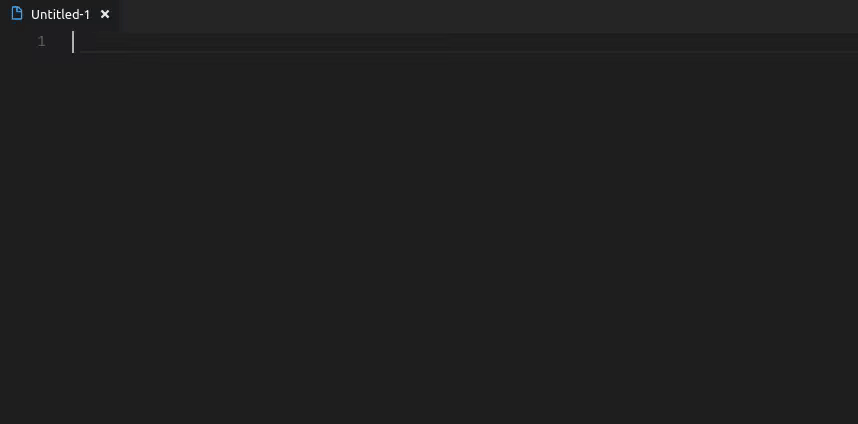
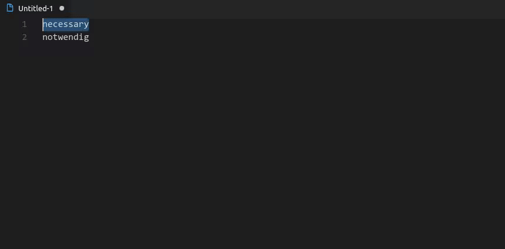

# Altervista Thesaurus

This is an extension for [Visual Studio Code](https://code.visualstudio.com/) which adds commands for looking up and replacing/inserting words via [thesaurus.altervista.org](http://thesaurus.altervista.org).

## Requirements

This extension requires getting a **free API key [from altervista](http://thesaurus.altervista.org/mykey)** to function. Upon first use of the command, the user will be prompted for the key. The key can also be changed via the setting `altervista-thesaurus.key`.

## Features

If there is a selection, the synonyms command will look up said selection and replace it if one of looked up words is selected. If there is no selection the user is prompted for input and any selected word will be inserted at the cursor.



The default lookup language can be set via the setting `altervista-thesaurus.lang`. To look up a word in another language without changing this setting, another command ("Synonyms in Specified Language") can be invoked which prompts for language selection before lookup.



It is also possible to bind the synonyms command to a keyboard shortcut with `args` being set to a valid language key, e.g.:

```json
{
    "key": "ctrl+l g",
    "command": "altervista-thesaurus.synonyms",
    "args": "de_DE"
},
```

The lookup commands can also be invoked from the text editor context menu.

## Supported Languages

The following languages are supported by the service:

- English (US)
- French
- German
- Greek
- Italian
- Norwegian
- Portuguese
- Romanian
- Russian
- Slovak
- Spanish